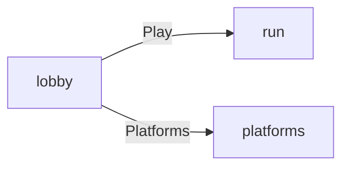

# The example

The example is the game `new_game` writes from the `example` template. The hero starts in a lobby in the meadow, and the player picks one of two levels: a run for three coins against the clock, or a climb up five platforms.

The following table lists the scenes:

| Scene       | What the player does                                                         | How it ends                                                                      |
| ----------- | ---------------------------------------------------------------------------- | -------------------------------------------------------------------------------- |
| `lobby`     | Looks round the meadow and picks a level.                                    | A button opens `run` or `platforms`.                                             |
| `run`       | Walks to three coins in a line, a tree beside them and a ball past the last. | Every coin within 20 seconds wins the round, and the clock running out loses it. |
| `platforms` | Jumps up five platforms under a side camera.                                 | It has no ending: the top platform is the goal.                                  |

The wallet's coin count shows in the top-right corner in every scene. The game also registers one item, the potion, and one model file under two names, `tree-tall` and `tree`.
